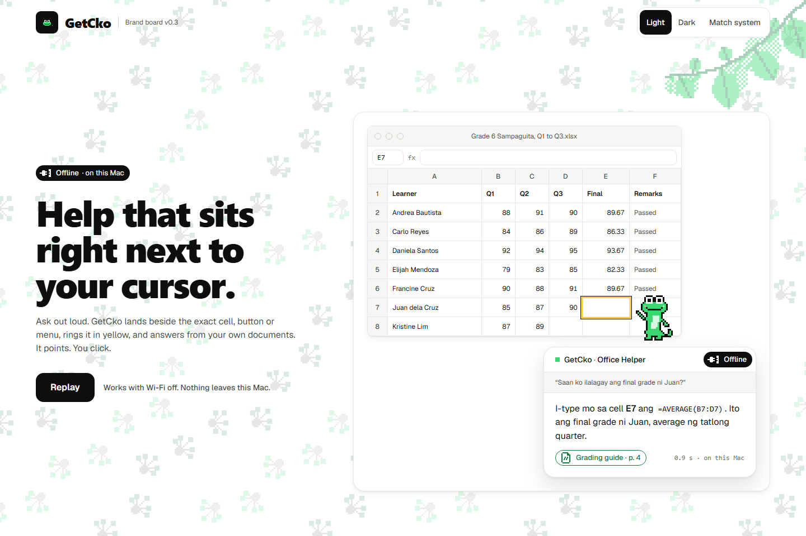

# GetCko



## Project name

**GetCko**, an offline desktop copilot. Built for the AppBuildersPH 2026 "Local AI" challenge.

## Problem

People are being pushed onto digital tools faster than they can learn them, and the help that exists, cloud AI assistants, needs a screenshot of a screen full of private data plus a working internet connection.

- **Digitization is now law.** The E-Governance Act (RA 12254), signed Sept 5, 2025, requires national agencies, LGUs, state universities and GOCCs to digitize their services ([w.media](https://w.media/marcos-signs-law-in-push-for-digital-transformation/)).
- **Low digital skills.** Only about 40% of Filipinos have at least one of the six basic ICT skills, lowest among people aged 65 and over ([PIDS](https://pids.gov.ph/details/fact-friday-on-digital-literacy-skills-of-filipinos)).
- **Privacy holds people back from AI.** 81.4% of developers have security or privacy concerns about AI agents, and 28.2% say their company forbids agent tools ([Stack Overflow 2025](https://survey.stackoverflow.co/2025/ai)).

Teachers, LGU staff and office workers on newly digitized systems need "where do I click, and why?" answered on their own screen, without sending citizen, student or client data to a cloud.

## Brief description

GetCko stays on screen while you work. Ask it a question by typing or by holding a key and talking:

- **Screen Help:** it points at the button or field you need with a gecko and a halo, and explains it. For a task with several steps, it points at one step at a time and moves on with **Next step**.
- **Your documents (RAG):** it answers from your own PDFs, Word, PowerPoint and text files, and cites the passage.
- **Customizable agents:** templates such as Office Helper, Teacher and Study Buddy, each with its own instructions, answer length, voice and knowledge bases.
- **Voice:** hold to talk, and answers are spoken aloud.

Every model runs on your Mac. Nothing is uploaded, and it works with Wi-Fi off.

## Tools

| Tool | Used for |
|---|---|
| [Tauri 2](https://tauri.app/) (Rust) | Desktop app, windows, global shortcut |
| React 19, TypeScript, Vite, Tailwind CSS 4 | Main window and on-screen overlay |
| [llama.cpp](https://github.com/ggml-org/llama.cpp) through `llama-cpp-2` (Metal) | Running the models on the GPU |
| [whisper.cpp](https://github.com/ggml-org/whisper.cpp) (separate helper process) | Speech to text |
| SQLite with [sqlite-vector](https://github.com/sqliteai/sqlite-vector) 1.1.2 | Agents, knowledge bases and document search |
| macOS Accessibility, CoreGraphics and Vision | Reading the screen, screenshots, on-device text recognition |
| macOS speech voices (AVFoundation) | Spoken answers |
| GSAP, three.js | Animation |
| [bun](https://bun.sh/) | Packages and scripts |
| Claude Code; OpenAI Codex | AI coding assistants used during development (Codex also generated the landing page's design mocks) |

## Assets

| Asset | Source | License |
|---|---|---|
| GetCko gecko sprite, poses, app icon, icons, textures | The team's GetCko brand kit v0.4 (`src/brand/`, `docs/brand/`) | The team's own |
| Bricolage Grotesque, Geist, Geist Mono, Silkscreen fonts | [Fontsource](https://fontsource.org/), bundled locally | OFL-1.1 |
| Pixelarticons | [pixelarticons](https://pixelarticons.com/) | MIT |

## Models

All models are downloaded once by `bun run models` (listed with SHA-256 checksums in `src-tauri/models.json`) and run locally.

| Model | Used for | Size | License |
|---|---|---|---|
| Gemma 4 E2B Instruct (Q4_0) and its vision/audio projector | Answers, reading screenshots, planning steps | 3.4 GB | [Gemma Terms of Use](https://ai.google.dev/gemma/terms) |
| bge-small-en-v1.5 (Q8_0) | Document search | 37 MB | MIT |
| Whisper small.en | Speech to text | 488 MB | MIT |
| Qwen3-VL 2B Instruct (Q4_K_M) and its projector | Pointing on screens whose buttons cannot be read | 1.6 GB | Apache-2.0 |

## How to run

Tested from a clean clone on an Apple Silicon Mac (M4 Pro, macOS 27.0.1, Xcode installed, Rust 1.99, bun 1.4.2, CMake 4.4).

### What you need

- **A Mac with Apple Silicon** (M1 or newer). Intel Macs are not supported. 16 GB of memory is recommended.
- **About 20 GB of free disk space:** 5.4 GB of models, a 5.1 GB app, and build files.
- **An internet connection for setup only.** GetCko itself runs offline.
- **Tools:**

  | Tool | Install |
  |---|---|
  | Xcode Command Line Tools | `xcode-select --install` |
  | [Homebrew](https://brew.sh/) | see its website |
  | CMake | `brew install cmake` |
  | Rust 1.88 or newer | `curl --proto '=https' --tlsv1.2 -sSf https://sh.rustup.rs \| sh` |
  | [bun](https://bun.sh/) | `curl -fsSL https://bun.sh/install \| bash` |

  Open a new terminal after installing Rust and bun.

### Build and open the app

From the repository root:

```sh
bun install                         # web packages
bun run models                      # downloads 5.4 GB of models once and checks each file
bash scripts/build-whisper.sh       # builds the speech-to-text helper
bun run tauri:build --bundles app   # builds GetCko.app with the models inside
open src-tauri/target/release/bundle/macos/GetCko.app
```

The first build takes several minutes because it compiles llama.cpp. Build it in a normal folder, such as your home folder; macOS blocks parts of an app that runs from `/tmp`.

To run without building an app, use `bun run tauri dev` after `bun run models`. In that mode macOS gives the permissions below to the terminal app that started it (Terminal, iTerm, VS Code, …), not to GetCko.

### First run

1. **Wait for the models.** The first launch shows "Getting the models ready" for about 25 seconds. Later launches take about a second.
2. **Allow the permissions** GetCko asks for. If macOS sends you to System Settings > Privacy & Security, switch GetCko on there.

   | Permission | What it is for | Needed? |
   |---|---|---|
   | Accessibility | Reading the buttons and fields of the app you are using, so GetCko can point at them | Yes, for pointing |
   | Screen Recording | Screenshots of screens whose buttons cannot be read | Optional. macOS asks you to quit and reopen GetCko. |
   | Microphone | Hold to talk | Optional |

3. **Pick an agent.** On the Agents page click **Use Office Helper**.
4. **Close the main window** (⌘W). The GetCko bar stays at the bottom of the screen; click its agent name to open the window again.
5. **Ask.** Open any app, tap **⌥ Space** (Option+Space), type a question such as "How do I make the title bold?" in TextEdit, and press Return. Hold **⌥ Space** to ask by voice instead. Press Esc to stop an answer.

### If something goes wrong

| Problem | Fix |
|---|---|
| `bun run models` stops with "checksum mismatch" | The download was cut off. Run it again; it resumes. |
| A permission is on but GetCko still says it is off | Rebuilding changes the app's signature. Remove GetCko from that list in System Settings with the minus button, open GetCko again and allow it again. `tccutil reset All com.getcko` clears every GetCko permission at once. |
| ⌥ Space does nothing | Another app may use Option+Space (Raycast, Alfred, ChatGPT and other launchers). Quit it or change its shortcut, then reopen GetCko. |
| "Pick an agent first." | Agents page > Use Office Helper. |
| "Apple could not verify GetCko" (an app you were sent, not one you built) | Run `xattr -dr com.apple.quarantine /path/to/GetCko.app`, then open it again. The app is not notarised. |
