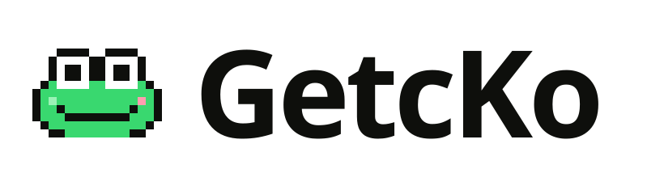

  

# Help that sits right next to your cursor.

**Gets mo na.** A private, offline desktop helper. Ask out loud; a pixel gecko points at the answer.

`Wi-Fi off` · `Nothing leaves this Mac` · `Points, never clicks` · `Taglish-ready`

## How it works

<table>
  <tr>
    <td align="center" width="33%"> <b>1. Ask</b> Press <code>⌥ Space</code>, ask out loud.</td>
    <td align="center" width="33%"> <b>2. GetcKo points</b> One yellow ring on the exact cell.</td>
    <td align="center" width="33%"> <b>3. Source</b> <code>Grading guide · p. 4</code></td>
  </tr>
</table>

## Why on this Mac

| | |
|---|---|
| **Private** | Screens with student, citizen or client data never leave the machine |
| **Offline** | Works in airplane mode; no account, no server, no API bill |
| **Grounded** | Answers cite your own documents, or say "I don't know" |
| **Any app** | Reads the macOS accessibility tree; screenshot fallback is labeled "Best guess" |

Proof: `Wi-Fi off · Nothing leaves this Mac.` Speed figures appear only once measured (`docs/MODELS.md`).

## Run it

| Step | Command |
|---|---|
| Install | `bun install` (or `npm install`) |
| Desktop app | `bun run tauri dev` |
| Web UI only | `bun run dev` |
| Build | `bun run tauri build` |

- Needs Rust + the Tauri 2 prerequisites, macOS 14+ (Apple silicon for the demo numbers).
- First run asks for Accessibility → Screen Recording → Microphone, then shows the shortcut.
- Models download once before use; after that everything runs with Wi-Fi off.

## Disclosures

**Models** (details and measurements: `docs/MODELS.md`)

| Job | Model | License |
|---|---|---|
| Chat, element picking, vision fallback | Gemma 4 E2B, 4-bit | Gemma terms (verify before submission) |
| Embeddings | EmbeddingGemma-300m | Gemma terms (gated) |
| Vector search | sqlite-vector | Elastic License 2.0, free for OSI-licensed open-source projects |
| Speech-to-text | whisper.cpp (`whisper-rs`) | MIT |
| Text-to-speech | OS voices via the Rust `tts` crate | MIT |

**Frameworks and assets**

| Item | License |
|---|---|
| Tauri 2, React 19, Vite, Tailwind CSS v4 | MIT / Apache-2.0 |
| GSAP | GSAP standard license (free) |
| [pixelarticons](https://github.com/halfmage/pixelarticons) © 2019 Gerrit Halfmann | MIT; base set for generic icons |
| Bricolage Grotesque, Geist, Geist Mono, Silkscreen (fontsource, bundled) | SIL Open Font License |
| GetcKo sprite, icons, textures, logo | Made for this project (`src/brand/`, `public/brand/`) |

**Submission checklist** (from the PRD)

- [ ] Public repo under MIT or Apache-2.0 (also covers the sqlite-vector open-source exception)
- [ ] Existing code and assets disclosed: anything reused from GetcKo v1, brand art, the `.claude/` config
- [ ] Models, frameworks and licenses listed (above)
- [ ] Local vs internet: everything in the core path runs on this Mac; internet only for the first model download
- [ ] AI dev tools disclosed: Claude Code (Anthropic) for code, docs and brand assets; any others used by the team
- [ ] "Why does this benefit from running AI locally?" answered (see *Why on this Mac*)
- [ ] 1-minute demo video + X / LinkedIn post (#AppBuildersPH)
- [ ] Every number shown is reproducible from the benchmark script

## For contributors

| Read | For |
|---|---|
| `PRODUCT.md` | Who it's for, what it must do |
| `DESIGN.md` → `docs/getcko-design-system.md` | Tokens, components, recipes |
| `.claude/skills/getcko-brand/` | Say "use brand" to Claude Code |
| `docs/brand/` | Lexicon, icons, mascot poses, textures, video |
