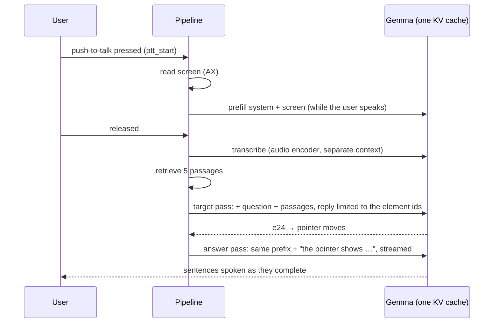

# Models and measured speed

Everything runs on the device; nothing downloads at runtime. `bun run models` fetches and checksums the files once into `src-tauri/models/`, and release builds bundle them.

| Role | File | Size | Notes |
| --- | --- | ---: | --- |
| Chat, speech-to-text, vision | `gemma-4-E2B-it-Q4_0.gguf` | 2.65 GiB | Gemma 4 E2B instruct, llama.cpp in-process (Metal on macOS, Vulkan on Windows, CPU fallback) |
| Audio and image projector | `mmproj-gemma-4-E2B-it-Q8_0.gguf` | 0.52 GiB | Loaded with the chat model through llama-cpp-2 `mtmd`; gives Gemma its audio (speech-to-text) and vision encoders |
| Embeddings | `embeddinggemma-300M-Q8_0.gguf` | 0.31 GiB | 256-d (Matryoshka), sqlite-vector exact scan |
| Text-to-speech | OS voices | — | `tts` crate (AVFoundation on macOS, WinRT on Windows) |

Why Gemma's own audio encoder instead of whisper.cpp: see [ADR 0004](../.monozukuri/decisions/0004-gemma-audio-speech-to-text.md).

## How a turn runs



The chat model keeps one llama context; each request only evaluates the tokens after the prefix it shares with what is already cached. The prompts are ordered so the screen (known at hotkey press) comes first and both passes share everything up to their task line.

## How to measure

```sh
bun run models            # once
RUNS=10 ./scripts/benchmark.sh
```

The script prints the machine, generates two spoken questions with `say`, and runs `src-tauri/examples/benchmark.rs` in release mode for each:

- **taglish**: the PRD demo question, "Saan ko ilalagay ang grade ni Juan, at paano kinukuwenta ang final grade?", read by the Spanish (Mexico) voice Paulina. macOS has no Filipino voice; Spanish spelling-to-sound is the closest stand-in for how a Filipino speaker says "Juan" (/hwan/).
- **en**: "Where do I put Juan's grade in the class record, and how is the final grade computed?", read by the English voice Samantha.

Each run uses a new Numbers-like class-record screen (40 elements; Juan Dela Cruz's Q1 cell is the right target), prefills it as push-to-talk would, transcribes the clip, runs both passes, times speech start, and snapshots whatever app is frontmost through the Accessibility API. A typed turn on a screen that was not prefilled runs alongside. One warm-up run is discarded. `RUST_LOG=getcko_lib=debug` adds the engine's per-request token counts.

## Latency benchmark

- Run date: 2026-10-09, branch `macos-engineer`
- Machine: Apple M4 Pro; macOS 27.0.1; 24.0 GiB RAM
- Runs: 10 after one warm-up per language

| Stage (median ms) | Taglish demo (5.1 s clip) | English (4.8 s clip) | PRD budget |
|---|---:|---:|---|
| Engine load (warm cache) | 836 | 865 | — |
| Screen prefill, while the user speaks | 576 | 566 | hidden by speech |
| Speech-to-text | 474 | 437 | T2 ≤ 1500 |
| Retrieval (embed + search) | 14 | 14 | — |
| Pointer target chosen (after STT) | 576 | 571 | — |
| Answer first token (after STT) | 646 | 641 | ≤ 300 |
| Answer first sentence (after STT) | 1011 | 975 | — |
| Answer complete (after STT) | 1548 | 1516 | — |
| TTS speech start | 6 | 6 | ≤ 500 |
| **End of speech → first spoken word** | **1494** | **1419** | about 3000 |
| AX snapshot (live app) | 24 | 11 | ≤ 200 |
| Typed, screen not prefilled: pointer target | 1143 | 1122 | — |
| Typed, screen not prefilled: first sentence | 1555 | 1439 | — |

p90 is within 25 ms of the median for every stage except the live AX snapshot (p90 22–27 ms). "After STT" stages start when transcription ends; end of speech → first spoken word = STT + first sentence + TTS start in the same run. Microphone capture is not built yet, so a WAV file stands in for it. The first launch of a new build adds about 15 s to engine load while Metal compiles its shaders.

Before this design (same machine and English clip, one pass, a new context per request, no cache reuse): end of speech → first spoken word 2155 ms; the answer's first token came 1276 ms after generation started.

### Accuracy

| Check | Taglish demo | English |
| --- | --- | --- |
| Transcript | "Sanko, ilalagayan grade ni **Juan** at paano kinukwentahan final grade." | "Where do I put **one's** grade in the class record and how is the final grade computed?" |
| Pointer on Juan's Q1 cell, spoken | 10/10 | 0/10 (Juan → "one's") |
| Pointer on Juan's Q1 cell, typed | 10/10 | 10/10 |
| Answers citing the manual | 10/10 | 10/10 |

Before this design the typed English question pointed correctly 0/10 times.

## Findings

1. **Fixed: wrong prompt format.** llama.cpp's built-in template detection does not know Gemma 4's Jinja template, so every prompt fell back to Gemma 3 tags (`<start_of_turn>`), which Gemma 4 does not treat as turns: answers ran on into fake turn markers and transcription of hinted prompts ran to the 96-token cap. Prompts now use Gemma 4's `<|turn>role … <turn|>` format (`engine::llama::gemma4_prompt`).
2. **Fixed: pointer target on compound questions.** A separate target pass, constrained by a grammar to the element ids or `none`, and grounded in the retrieved passages (the manual names the Q1 cell), replaced the `TARGET:` line in the answer. The answer pass is told which element the pointer shows.
3. **Faster: prefix reuse.** One persistent llama context; requests evaluate only the suffix after the cached prefix. The screen is prefilled during push-to-talk (`ptt_start`), and both passes share the question and passages. Prefill runs at about 900–1,000 tokens/s on this Mac, so tokens not evaluated are the main lever.
4. **Still over budget: first token (641–646 ms vs 300 ms).** Remaining work after speech ends is the question + passages (~400 tokens) and a few target tokens. Next levers: fewer or shorter passages, fewer screen elements by relevance, multi-token prediction (`mtp-gemma-4-E2B-it-Q4_0.gguf`, supported by llama-cpp-2's `MtpSpeculative`) for decode speed.
5. **Names: English pronunciation of "Juan" is heard as "one's".** With Filipino pronunciation (Taglish clip) Gemma transcribes "Juan" and points correctly 10/10. Telling the transcriber the on-screen names did not help: Gemma echoed the list into the transcript and still wrote "one's"; the Taglish/Filipino language hints did not change the English clip either. Retest with a real Filipino speaker.
6. **One `tts` instance per process on macOS.** The AVFoundation backend registers a process-wide delegate class, so a second `Tts::new` fails with "Operation failed". The engine's `OsSpeaker` owns the only one; the benchmark takes it before loading the engine.
7. **Fixed earlier:** the prompt's output-protocol example contained a literal `\n`, which the model copied, so no target or citation parsed.
