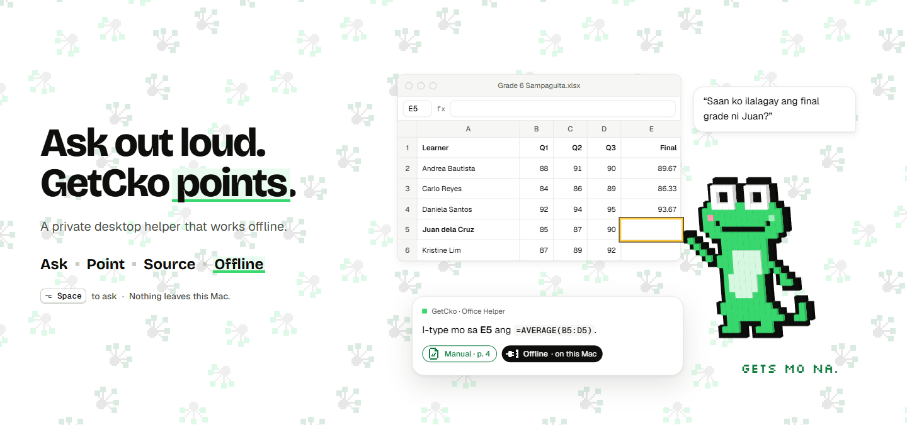
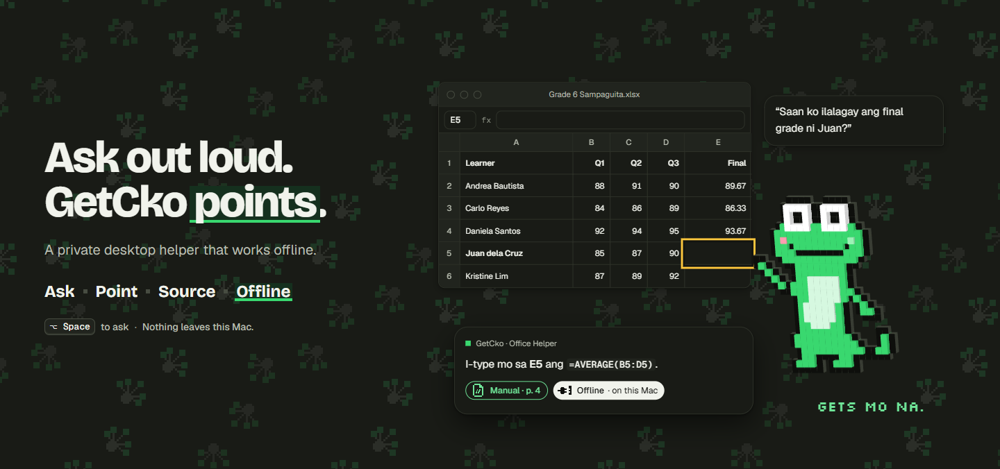

# GetcKo hero

The first-glance section: a judge should get GetcKo in about 3 seconds without reading much.




Code: `src/brand/hero/` (`GetCkoHero.tsx`, `timeline.ts`, `voxel.ts`, `copy.ts`, `index.ts`). QA page: `src/brand/hero/preview.html`.

## What it shows

- **Words (left):** headline "Ask out loud. GetcKo **points**." (5 words), support line `T.product.descriptor` (7 words), the keyword rail **Ask · Point · Source · Offline**, then `⌥ Space` to ask · Nothing leaves this Mac.
- **Picture (right):** a mock grade sheet (sample data). GetcKo, as a voxel model built from the real sprite map, hops to cell E5, the sun halo rings it, GetcKo speaks the Taglish answer, and the answer card shows the source chip `Manual · p. 4`, then `Offline · on this Mac`. Silkscreen "Gets mo na." sits under GetcKo at the end. That is the only `font-pixel` text on the screen.
- Eye path: ask (top right) → GetcKo → ringed cell → source (answer card).

## Story (~6 s, loops)

| Beat | Time | On stage | Rail word |
|---|---|---|---|
| Ask | 0.15 s | ink pill: `⌥ Space` + Listening; 0.75 s the question bubble | Ask |
| Point | 1.90 s | thinking pose, then a walk-frame hop (arc, `geckoLand`) to beside E5; 2.42 s `haloIn` | Point |
| Source | 2.90 s | answer card + "Speaking", mouth at 6 fps; 3.25 s source chip | Source |
| Offline | 4.10 s | `Offline · on this Mac` chip; 4.6 s tagline | Offline |
| hold, reset | 6.0 to 6.6 s | everything fades, halo out, GetcKo hops home | none |

The rail highlights one word at a time. Words that have not happened yet show at 42% opacity, words already done are full ink, and only the current word wears the marker.

## Keyword highlight treatment (decided)

**Gecko-wash block with a pixel foot.** A square-cornered `bg-accent-wash` block sits behind the word, with a 4px `bg-accent` bar along its bottom edge. The word itself stays `text-text` (ink in light, mist in dark), so contrast is unchanged, and green stays a fill (never text). The block bleeds 0.1em past the word on each side and does not move the text around it. Use it on one word in the headline, and on at most one live word in any rail. It is not a general emphasis style: when a highlight is needed elsewhere, use the same `Mark` markup from `GetCkoHero.tsx`.

## Voxel GetcKo

- One cube per sprite cell from `buildPose()`, all in one `InstancedMesh` (one draw call). Pose swaps rewrite the instance matrices and colors only when the pose or flip changes.
- Depth by cell kind: outline 1.2 cells, body 2.0, belly, eyes and highlight 2.4 to 2.6. That makes a low relief, and the ink rim sits behind.
- `MeshBasicMaterial` with a per-face shade baked into vertex colors (front 1.0, top 0.84, sides 0.62, bottom 0.48). This gives flat, hard edges with no lights, env map, bloom, glow or gradient. Front faces show the exact `PALETTE` colors, read from `--gc-sprite-*`.
- Orthographic camera in stage px. Body tilted 0.2 rad, turned 26° ± 4° toward the target, one sway per loop.
- Theme: colors are re-read from the CSS variables when the theme changes. In dark mode the outline cells' extruded sides take `--gc-night-line-strong`, so the silhouette reads on night. Front faces never change.
- `three` loads with a dynamic `import("./voxel")`. Until it arrives, and on machines without WebGL, the 2D `GetCkoSprite` (scale 10) plays the same frames.
- DPR is capped at 2 (times the stage's fit scale). The renderer is disposed (`forceContextLoss`) on unmount. Playback pauses offscreen (IntersectionObserver) and when the tab is hidden.
- Motion off: `prefers-reduced-motion` or `autoplay={false}` shows the static final frame (t = 5.0 s), with a static halo and no loop.

## Sizes

- The stage is drawn at a fixed 760 × 540 design size and CSS-scaled down to fit its column (never above 1), so the timeline coordinates stay the same at every width.
- At 1280 px and wider the layout is two columns, words 5/12 and stage 7/12. Below 1280 px (including the 800 px Tauri window) the words stack above the stage, the headline drops to `text-h1`, and the rail and shortcut share one row.
- `three` adds about 523 KB minified (about 132 KB gzip) in a lazy chunk. The hero component itself is about 20 KB gzip, mostly brand modules the app already ships.

## API

```tsx
import { GetCkoHero } from "./hero"; // from src/brand

<GetCkoHero />                     // follows the app theme, plays the loop
<GetCkoHero theme="dark" />        // force a theme for this section (Surface mode)
<GetCkoHero autoplay={false} />    // static final frame
<GetCkoHero at={2.6} />            // freeze on a time (captures, QA)
```

## Reusing the choreography (demo video / HyperFrames)

`buildHeroTimeline(root, opts)` is independent of React and three.js and safe to seek: there is no randomness, no wall clock and no `tl.call`. GetcKo's position, pose and yaw are a pure function of the playhead (`geckoAt(t, layout)`). Build it paused and add it to the master timeline:

```ts
import { buildHeroTimeline, HERO_TIMING } from "../src/brand/hero";

const tl = buildHeroTimeline(rootEl, {
  paused: true,
  loop: false,
  reduced: false,
  dark: true,                       // halo style; default reads the app theme
  cell: 10,                         // sprite cell size in stage px
  gecko: (f) => { /* f.x, f.y, f.pose, f.flip, f.yaw, f.cell: draw GetcKo */ },
});
master.add(tl, 0);                  // story length: HERO_TIMING.total (6.6 s)
```

DOM contract inside `root`: `[data-hero="stage"]` (coordinate space), `[data-hero="target"]` (gets the halo), the optional reveals `ask`, `question`, `answer`, `speaking`, `source`, `offline` and `tagline`, and rail words `[data-hero-beat="ask|point|source|offline"]`, each with a `[data-hero-mark]` child. Without a `gecko` driver, `[data-hero="gecko"]` is moved with a CSS transform. For a video frame, the simplest route is to render `<GetCkoHero at={t} />` or to drive the paused timeline with `tl.time(t)`.

## Copy

All strings come from `T` / `say` or are canonical lexicon terms. Three strings do not have a `lexicon.ts` key yet, and the lexicon owner should add them as `T.hero`:

| Proposed key | Text |
|---|---|
| `T.hero.headline` | Ask out loud. GetcKo points. (mark: "points") |
| `T.hero.beats.point` | Point |
| `T.hero.beats.source` | Source |

(`Ask` = `T.actions.ask`, `Offline` = `T.status.offline`, support = `T.product.descriptor`.) The question, answer and sheet are sample data in `copy.ts`, as in `Showcase.tsx`.

## QA

```sh
npx vite --host 127.0.0.1 --port 4182 --strictPort
# open /src/brand/hero/preview.html?theme=light|dark  &at=<s>  &still  &scroll
```

The screenshots above were taken with headless Edge (`--use-angle=swiftshader --enable-unsafe-swiftshader`) at `?at=5`. The no-WebGL path was checked with `--disable-3d-apis` and reduced motion with `--force-prefers-reduced-motion`.
