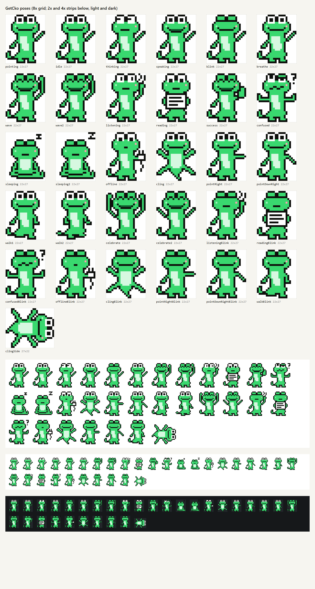

# GetcKo pose library

Extends design system §10 (mascot). Code: `src/brand/mascot/sprites.ts` (maps), `src/brand/mascot/moments.ts` (`MOMENT_POSE`). Contact sheet: `docs/brand/mascot-poses.png`.



Every pose uses the same palette (`K G L B W P D`), the same head (eye domes, highlight at left, pink cheek at right) and, except `clingSide`, the same 22 × 27 canvas with the head in the same place. Frame swaps inside a pose never move the head. `W` also fills paper props (the page, the plug).

## Moments

```ts
import { GetCkoSprite, MOMENT_POSE } from "./brand";
<GetCkoSprite pose={MOMENT_POSE.failed} scale={6} label="GetcKo, not sure" />
```

| Moment | Pose | Frames | Use it for |
|---|---|---|---|
| `idle` | `sleeping` | `sleeping` ↔ `sleeping2`, 1.2 s each | App idle, paused, mic off for a while. Slumped sit, eyes shut, z then Z. Head sits 4 rows lower. |
| `onboarding` | `wave` | `wave` ↔ `wave2`, 240 ms each, 3 to 4 cycles then hold `wave` | Welcome screen, first launch. Palm up, happy eyes, open smile. |
| `listening` | `listening` | blink `listeningBlink` | Push-to-talk held. Hand cupped at the cheek, wide eyes, two sound arcs, small mouth. |
| `thinking` | `thinking` | existing `thinkingLoop` | STT, retrieval, LLM running. |
| `processing` | `reading` | blink `readingBlink` | Knowledge base import, indexing. Holds a page in both hands, eyes down on it. |
| `screenHelp` | `pointing` | see "Pointing" | Screen Help answer beside the target. |
| `speaking` | `speaking` | existing `speakLoop` | TTS playing. |
| `ready` | `success` | none (happy eyes are closed) | Import finished, answer found, setup complete. Thumbs up. |
| `failed` | `confused` | blink `confusedBlink` | "Hindi ko alam", no source found, failed import. Friendly shrug, one squinting eye, wavy mouth, a "?". Never sad: pair with a next step. |
| `offline` | `offline` | blink `offlineBlink` | Offline badge, a local service is down. Holds an unplugged plug (two prongs, loose cord) and looks at it. |
| `empty` | `cling` | blink `clingBlink` | Empty states, the edge of a panel. Belly to the glass, limbs splayed, tail down. `clingSide` on horizontal edges. |
| `moving` | `walk1` | `walk1` ↔ `walk2`, 160 ms each | During a long flight between targets (optional; short flights keep the current pose). Blink `walkBlink`. |
| `endCard` | `celebrate` | `celebrate` ↔ `celebrate2`, 220 ms each, then hold `celebrate` | Demo video end card, onboarding finished. Both hands up, then a V. |

Ready-made loops: `POSE_CYCLES.wave | walk | sleep | celebrate | idle` are `[pose, seconds]` lists that drop straight into `frameLoop(setPose, frames)` in `src/brand/motion.ts`. `BLINK_OF[pose]` gives the blink frame for any pose with visible open eyes (swap in for ~120 ms every 3 to 6 s; never while the user types).

## Pointing

| Target is... | Pose | `flip` | Hand tip (cell, facing right) |
|---|---|---|---|
| up-right of the gecko | `pointing` | false | col 21, row 9 |
| right | `pointRight` | false | col 21, row 13 |
| below-right | `pointDownRight` | false | col 21, row 17 |
| up-left / left / below-left | same pose | true | mirrored col |

`pointPoseFor("upRight" | "right" | "downRight")` picks the pose; `handTip(flip, pose)` returns the cell to place beside the target (the second argument is optional and defaults to `pointing`, so existing callers are unchanged). Blink frames `pointRightBlink` and `pointDownRightBlink` keep the same tips.

## Cling on edges

`cling` is head-up: use it on a vertical edge (left or right side of a panel, flip to face inward). `clingSide` is the same map turned 90° clockwise (27 × 22, head pointing right): use it along a top or bottom edge, flip for head-left. This is the only sanctioned rotation of GetcKo; every other pose is flip-only. Size any layout with `poseSize(pose)`, not `SPRITE_W` / `SPRITE_H`, when `clingSide` is possible.

## Scale rules

Unchanged from §10: integer scales only (2 overlay, 3 inline, 6 empty state, 8 onboarding, 12 to 16 hero and video), `pixelated`, one GetcKo per screen, beside the target, never covering it.

- 2×: every silhouette reads (shrug, thumbs up, page, arms up, splayed cling). Fine details do not: the "?", the sound arcs and the plug prongs become 2 px marks. At 2× rely on the silhouette and the copy next to it.
- 3× and up: props read (page lines, plug, "?", z).
- On dark grounds at 1× to 3×, seat the sprite on a `surface-2` well as §10 says; the ink-heavy props (plug cord, sound arcs, "?") need it most.

## Rules for new poses

1. Same head: rows 0 to 8 of the base map, or a documented eye/mouth variant (closed `∩` happy eyes, wide eyes, eyes down, squint, closed). Keep the highlight left and the cheek right.
2. Every colored cell is closed by ink: no `G L B W P D` cell may touch transparent or the canvas edge. `validateSprites()` checks this, plus width, height, palette keys and that each blink frame keeps its parent's silhouette.
3. One readable prop at most, in `W` with a `K` outline. No new colors.
4. Faces right; flip handles left.
5. Check with the scripts below and look at the 2× strip before shipping.

## Scripts

```sh
node --experimental-strip-types scripts/brand/mascot-check.mjs   # sizes, palette, outline closure (both facings)
node --experimental-strip-types scripts/brand/mascot-sheet.mjs   # renders docs/brand/mascot-poses.png via headless Edge
node --experimental-strip-types scripts/brand/mascot-sheet.mjs out.png --only=wave,wave2 --scale=12
```

## Base map changes

Three cells of the §10 base map were closed so the outline check passes: row 14 col 17 (`K`, under the pointing arm's shoulder) and row 24 cols 10 to 11 (`K`, between the legs). Row 14 reads `.....KGGBBBBGGGGKK....` and row 24 reads `.KKKKKKGGKKKKGGK......`. The design system §10 map should be updated to match.
